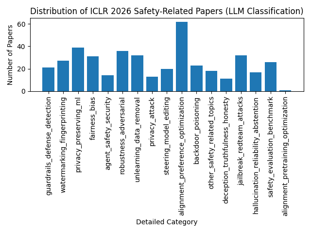

# ICLR 2026 Safety-Related Papers (Grouped by Detailed Category)

Data source: `paper_info/llm_category_iclr_2026_safety_papers_info.jsonl`

## Categories

## Distribution

- `jailbreak_redteam_attacks` (32): [jailbreak_redteam_attacks.md](jailbreak_redteam_attacks.md)
  - 越狱/提示注入/红队攻击相关。包括 jailbreak prompts、prompt injection、system prompt extraction、拒答绕过、角色扮演绕过、多轮诱导、自动化红队与攻击链、攻击可迁移性与自动生成攻击等。
- `alignment_preference_optimization` (62): [alignment_preference_optimization.md](alignment_preference_optimization.md)
  - 对齐训练与偏好优化方法。包括 RLHF/RLAIF、DPO/IPO/KTO 等偏好学习、reward modeling、constitutional AI、对齐数据构建、对齐训练稳定性、对齐泛化与分布外行为等。
- `deception_truthfulness_honesty` (11): [deception_truthfulness_honesty.md](deception_truthfulness_honesty.md)
  - 欺骗/不诚实与真实性。包括 deception、sycophancy、truthfulness、honesty、faithfulness、lie detection、model intent、self-report 可靠性、confabulation 与对抗性说服等。
- `steering_model_editing` (20): [steering_model_editing.md](steering_model_editing.md)
  - 可控性/行为引导/模型编辑。包括 steering、activation steering、control vectors、prompting/系统指令策略、模型编辑与局部修正、可解释的控制机制、工具使用/代理行为约束等。
- `robustness_adversarial` (36): [robustness_adversarial.md](robustness_adversarial.md)
  - 对抗鲁棒性与分布外稳健性。包括 adversarial examples、攻击/防御、鲁棒训练、OOD detection、certified robustness、对抗评测与鲁棒泛化等。
- `backdoor_poisoning` (23): [backdoor_poisoning.md](backdoor_poisoning.md)
  - 后门/数据投毒与供应链攻击。包括 backdoor triggers、训练数据投毒、微调投毒、RAG/检索投毒、模型供应链安全、后门检测与移除、数据审计等。
- `watermarking_fingerprinting` (27): [watermarking_fingerprinting.md](watermarking_fingerprinting.md)
  - 生成内容水印/指纹与模型溯源。包括 text/image watermarking、fingerprinting、membership/provenance attribution、去水印攻击与鲁棒水印、来源追踪与取证等。
- `safety_evaluation_benchmark` (26): [safety_evaluation_benchmark.md](safety_evaluation_benchmark.md)
  - 安全评测、基准与测量方法。包括 safety benchmarks、jailbreak eval、toxicity/harmful capability evaluation、模型行为测量、红队评测协议、评测偏差与可重复性等。
- `guardrails_defense_detection` (21): [guardrails_defense_detection.md](guardrails_defense_detection.md)
  - 安全防护与检测机制。包括 content moderation、policy enforcement、filtering、refusal/abstention 机制、输入输出检测器、工具调用防护、RAG 安全防护、运行时监控与审计等。
- `fairness_bias` (31): [fairness_bias.md](fairness_bias.md)
  - 公平性/偏见与社会影响。包括 group fairness、bias measurement/mitigation、stereotypes、representation harms、资源分配不均、跨语言/跨文化公平、社会技术影响分析等。
- `privacy_attack` (13): [privacy_attack.md](privacy_attack.md)
  - 隐私攻击与泄露风险。包括 membership inference、data extraction、model inversion、PII leakage、prompt leakage、training data reconstruction、attack surfaces in RAG/tools 等。
- `privacy_preserving_ml` (39): [privacy_preserving_ml.md](privacy_preserving_ml.md)
  - 隐私保护机器学习与隐私机制。包括 differential privacy、federated learning、secure aggregation、privacy auditing、redaction、access control、confidential computing 相关等。
- `agent_safety_security` (14): [agent_safety_security.md](agent_safety_security.md)
  - Agent/工具使用/系统层安全。包括 tool misuse、multi-agent 安全、权限与隔离、prompt injection in tools/RAG、sandboxing、capability containment、autonomous agents 风险评估与防护等。
- `unlearning_data_removal` (32): [unlearning_data_removal.md](unlearning_data_removal.md)
  - 机器遗忘/数据删除与合规。包括 unlearning、right-to-be-forgotten、data removal、certifiable deletion、遗忘评测与遗忘-效用权衡等。
- `hallucination_reliability_abstention` (17): [hallucination_reliability_abstention.md](hallucination_reliability_abstention.md)
  - 幻觉/可靠性/不确定性与拒答。包括 hallucination detection/mitigation、calibration、selective prediction、uncertainty estimation、abstention、factuality/grounding、引用与证据一致性等。
- `other_safety_related_topics` (18): [other_safety_related_topics.md](other_safety_related_topics.md)
  - 其他安全相关主题（兜底）。当论文与上述类别均不匹配，但仍属于安全/风险/治理/合规/伦理/社会影响等方向时归入此类。

## Uncategorized / Unknown

- `unknown_category` (1): [unknown_category.md](unknown_category.md)
